# System Architecture

This document provides a comprehensive overview of the Trading API system architecture.

## Architecture Diagram

```mermaid
graph TB
    subgraph "Client Layer"
        User[User/Trader]
        Browser[Web Browser]
    end

    subgraph "Frontend - Next.js 14"
        NextApp[Next.js App Router]
        Pages[Pages/Routes]
        Components[React Components]
        APIClient[API Client]
        AuthLib[Supabase Auth Client]
        Store[State Management]
        
        NextApp --> Pages
        Pages --> Components
        Components --> APIClient
        Components --> AuthLib
        Components --> Store
    end

    subgraph "Backend - FastAPI"
        FastAPI[FastAPI Server]
        CORS[CORS Middleware]
        Logger[Request/Response Logger]
        
        subgraph "API Routes"
            TradingRoutes[Trading Routes]
            SupabaseRoutes[Supabase Auth Routes]
        end
        
        subgraph "Authentication Layer"
            ClientAuth[Client Auth CSV]
            SupabaseAuth[Supabase Middleware]
            EmailValidator[Email Validator]
        end
        
        subgraph "Services Layer"
            TradingService[Trading Service]
            PositionsService[Positions Service]
            OrdersService[Orders Service]
            PnLService[PnL Service]
        end
        
        subgraph "Strategy Engine"
            StrategyManager[Strategy Manager]
            BaseStrategy[Base Strategy]
            BreakoutBot[Breakout Bot]
            BreakoutService[Breakout Service]
        end
        
        subgraph "Utilities"
            LoggingUtils[Logging Utils]
            DeltaClient[Delta REST Client]
        end
        
        FastAPI --> CORS
        FastAPI --> Logger
        FastAPI --> TradingRoutes
        FastAPI --> SupabaseRoutes
        
        TradingRoutes --> ClientAuth
        TradingRoutes --> SupabaseAuth
        TradingRoutes --> EmailValidator
        
        TradingRoutes --> TradingService
        TradingRoutes --> PositionsService
        TradingRoutes --> OrdersService
        TradingRoutes --> PnLService
        TradingRoutes --> StrategyManager
        
        StrategyManager --> BaseStrategy
        BaseStrategy --> BreakoutBot
        BreakoutBot --> BreakoutService
        BreakoutService --> DeltaClient
        
        TradingService --> DeltaClient
        PositionsService --> DeltaClient
        OrdersService --> DeltaClient
        PnLService --> DeltaClient
        
        LoggingUtils --> TradingService
        LoggingUtils --> StrategyManager
    end

    subgraph "External Services"
        Supabase[(Supabase DB & Auth)]
        DeltaExchange[Delta Exchange API]
        FearGreedAPI[Fear & Greed Index API]
    end

    subgraph "Data Storage"
        ClientCSV[Client Credentials CSV]
        LogFiles[Log Files]
        PIDFiles[Process ID Files]
    end

    subgraph "Deployment Infrastructure"
        subgraph "Local Development"
            Docker[Docker Compose]
            StartScripts[Start/Stop Scripts]
        end
        
        subgraph "AWS EC2"
            EC2[EC2 Instance]
            Systemd[Systemd Services]
            Nginx[Nginx Reverse Proxy]
        end
    end

    User --> Browser
    Browser --> NextApp
    NextApp --> FastAPI
    
    AuthLib --> Supabase
    SupabaseAuth --> Supabase
    SupabaseRoutes --> Supabase
    
    ClientAuth --> ClientCSV
    
    DeltaClient --> DeltaExchange
    TradingRoutes --> FearGreedAPI
    
    LoggingUtils --> LogFiles
    StartScripts --> PIDFiles
    
    Docker --> FastAPI
    Docker --> NextApp
    
    EC2 --> Systemd
    Systemd --> FastAPI
    Systemd --> NextApp
    EC2 --> Nginx
    Nginx --> FastAPI
    Nginx --> NextApp

    style User fill:#e1f5ff
    style Browser fill:#e1f5ff
    style NextApp fill:#61dafb
    style FastAPI fill:#009688
    style Supabase fill:#3ecf8e
    style DeltaExchange fill:#ff9800
    style Docker fill:#2496ed
    style EC2 fill:#ff9900
```



## System Components

### 1. Frontend (Next.js 14)

**Technology Stack:**
- Next.js 14 with App Router
- React 18
- TypeScript
- Tailwind CSS
- Supabase Client SDK

**Key Features:**
- Server-side rendering (SSR)
- Client-side state management
- Authentication integration
- Real-time trading interface
- Responsive design

**Main Routes:**
- `/` - Landing page
- `/login` - User authentication
- `/reset-password` - Password recovery
- `/dashboard` - Main dashboard
- `/strategies` - Strategy management
- `/orders` - Order history and management
- `/settings` - User settings

### 2. Backend (FastAPI)

**Technology Stack:**
- FastAPI
- Python >=3.12
- Uvicorn (ASGI server)
- Pydantic for data validation

**API Structure:**
- **Trading Routes** (`/api/v1/`):
  - `POST /place-limit-order-wait` - Place orders with SL/TP
  - `POST /login` - Client authentication
  - `GET /positions` - Fetch positions
  - `GET /orders` - Fetch order history
  - `GET /pnl` - PnL calculations
  - Strategy management endpoints

- **Supabase Routes** (`/api/supabase/`):
  - Authentication endpoints
  - User management

### 3. Authentication System

**Two-Layer Authentication:**

1. **Supabase Authentication:**
   - Email/password authentication
   - JWT token management
   - Session handling
   - Password reset functionality

2. **Client Authorization:**
   - CSV-based whitelist validation
   - Client ID and email verification
   - Trading credentials management

### 4. Services Layer

**Trading Service:**
- Order placement with stop-loss and take-profit
- Wait-for-price functionality
- Order status monitoring

**Positions Service:**
- Real-time position tracking
- Position management
- Delta Exchange integration

**Orders Service:**
- Order history retrieval
- Order status tracking
- Trade execution logging

**PnL Service:**
- Profit and loss calculations
- Performance metrics
- Historical PnL tracking

### 5. Strategy Engine

**Strategy Manager:**
- Manages multiple trading strategies
- Start/stop/status control
- Strategy lifecycle management

**Base Strategy:**
- Abstract base class for strategies
- Common strategy interface
- Shared functionality

**Breakout Strategy:**
- Automated breakout detection
- Entry/exit logic
- Risk management

### 6. External Integrations

**Delta Exchange API:**
- Cryptocurrency trading platform
- Order execution
- Market data
- Position management

**Supabase:**
- PostgreSQL database
- Authentication service
- Real-time subscriptions
- User management

**Fear & Greed Index API:**
- Market sentiment data
- Cached for 5 minutes
- Used for strategy decisions

### 7. Data Storage

**Client Credentials:**
- CSV file: `backend/privatedata/srp_client_trading.csv`
- Format: `srp_client_emailid,srp_client_id,srp_password`
- Not committed to git (security)

**Logging:**
- Backend logs: `backend/logs/bot.log`
- Per-user logs: `backend/logs/user_{client_id}/`
- Frontend logs: `logs/frontend.log`
- Rotating file handlers (10MB max)
- 5 backup files retained

**Process Management:**
- PID files: `backend/backend.pid`, `frontend/frontend.pid`
- Used by start/stop scripts

## Deployment Options

### Local Development

**Docker Compose:**
```yaml
Services:
  - backend (port 8501)
  - frontend (port 3000)
```

**Management Scripts:**
- `start-all.sh` - Start both services
- `stop-all.sh` - Stop both services
- `restart-all.sh` - Restart both services
- `view-logs.sh` - View logs

### AWS EC2 Deployment

**Infrastructure:**
- EC2 instance (Ubuntu/Linux)
- Systemd services for process management
- Nginx as reverse proxy
- PM2 for Node.js process management

**Systemd Services:**
- `trading-backend.service`
- `trading-frontend.service`

**Nginx Configuration:**
- Reverse proxy for backend API
- Static file serving for frontend
- SSL/TLS termination
- Load balancing (if needed)

## Data Flow

### User Login Flow

```
User → Browser → Next.js Auth → Supabase Auth → JWT Token
                                                    ↓
User Profile ← Next.js ← Supabase User Data ← Validation
                ↓
        Backend API Call → Client Auth → CSV Validation
                ↓
        Trading Access Granted
```

### Order Placement Flow

```
User Input → Frontend Form → API Client → Backend Trading Route
                                                    ↓
                                    Authentication Check (JWT + CSV)
                                                    ↓
                                    Trading Service → Order Validation
                                                    ↓
                                    Delta Client → Delta Exchange API
                                                    ↓
                                    Order Confirmation → User Notification
                                                    ↓
                                    Logging → Log Files
```

### Strategy Execution Flow

```
User → Start Strategy Request → Backend Strategy Manager
                                            ↓
                                    Create Strategy Instance
                                            ↓
                                    Start Background Task
                                            ↓
        Market Data ← Delta Client ← Strategy Bot → Trading Logic
            ↓                                           ↓
        Analysis → Entry/Exit Signals → Order Placement
            ↓
        Continuous Monitoring → Position Management
```

## Security Features

1. **Authentication:**
   - Supabase JWT tokens
   - CSV-based client whitelist
   - Password hashing

2. **API Security:**
   - CORS middleware
   - Request validation (Pydantic)
   - Rate limiting (via caching)

3. **Credential Management:**
   - Environment variables for secrets
   - Private data excluded from git
   - No API keys in logs

4. **Logging Security:**
   - Sensitive data sanitization
   - Per-user log isolation
   - Rotating file handlers

## Scalability Considerations

1. **Horizontal Scaling:**
   - Stateless API design
   - External session storage (Supabase)
   - Load balancing ready

2. **Performance:**
   - Async/await for I/O operations
   - Connection pooling
   - Response caching (Fear & Greed Index)

3. **Monitoring:**
   - Request/response logging
   - Error tracking
   - Performance metrics

## Technology Choices

| Component | Technology | Reason |
|-----------|-----------|--------|
| Backend Framework | FastAPI | High performance, async support, automatic API docs |
| Frontend Framework | Next.js 14 | SSR, App Router, TypeScript support |
| Database/Auth | Supabase | Managed PostgreSQL, built-in auth, real-time |
| Styling | Tailwind CSS | Utility-first, responsive, fast development |
| API Client | Delta Exchange | Cryptocurrency trading, Indian market |
| Process Management | Systemd/PM2 | Reliable, auto-restart, logging |
| Containerization | Docker | Consistent environments, easy deployment |

## Development Workflow

1. **Local Development:**
   ```bash
   ./start-all.sh  # Start both services
   # Frontend: http://localhost:3000
   # Backend: http://localhost:8501
   # API Docs: http://localhost:8501/docs
   ```

2. **Testing:**
   - Backend: Unit tests in `backend/tests/`
   - Frontend: Component tests in `frontend/tests/`

3. **Deployment:**
   - Build Docker images
   - Push to registry
   - Deploy to EC2
   - Configure systemd services
   - Setup Nginx reverse proxy

## Future Enhancements

1. **Additional Strategies:**
   - Mean reversion
   - Trend following
   - Arbitrage

2. **Enhanced Monitoring:**
   - Prometheus metrics
   - Grafana dashboards
   - Alert system

3. **Multi-Exchange Support:**
   - Binance integration
   - Bybit integration
   - Unified trading interface

4. **Advanced Features:**
   - Backtesting engine
   - Portfolio analytics
   - Risk management tools
   - Mobile application
